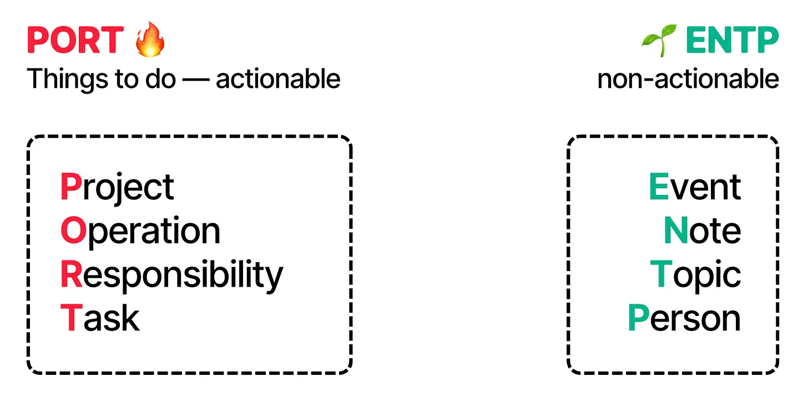
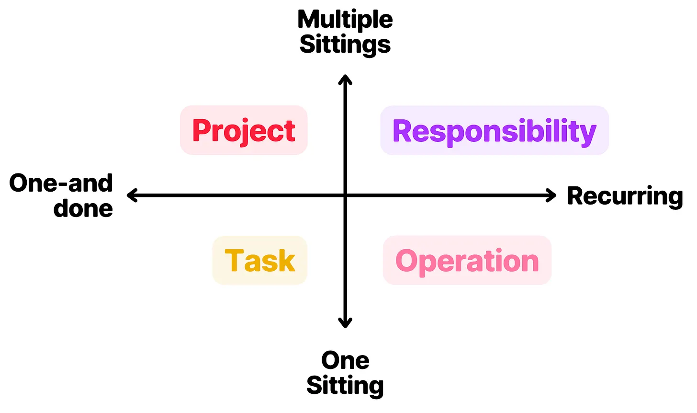
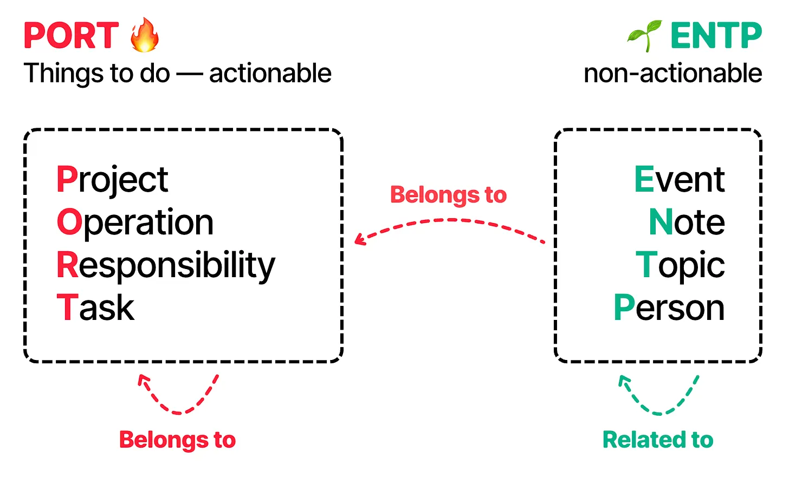
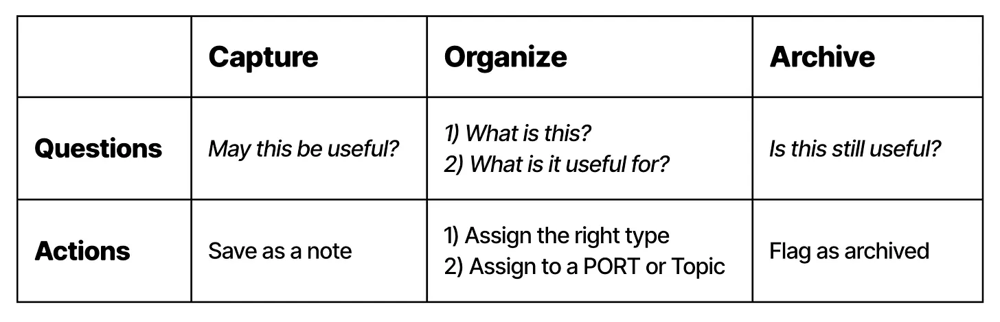

# Introducing Portent

Today it's almost one month since I released Tolaria, and during this time I have spoken with many people and teams that are trying to use it to create and manage internal knowledge bases.

During these chats, the most recurring questions I receive are not about the tool itself, but about **how to organize information**.

People understand the tool: types, relationships, views, etc — but are not sure about what types to create, how to connect them together, and what the regular maintenance of all of this looks like.

To help with this, today I am introducing **Portent** — an open spec for organizing knowledge bases, for work and life.

Portent provides strong defaults for the three key aspects of a knowledge base:

1. **Structures** — how information is organized into different buckets, whether it's types, folders, or else.
2. **Relationships** — how such structures are connected and related one another.
3. **Lifecycle** — how information flows and is operated.

Portent is built with some specific goals in mind:

- **Convention over configuration** — Portent is like the Rails of knowledge bases. Gives you sane defaults, but keeps you free to extend / change whatever you like
- **Usable with any tool** — while Portent concepts are first-class citizens in Tolaria, they can be easily implemented in any knowledge mgmt tool.
- **Combine life and work** — create knowledge bases that *blend* personal and work data, over the same underlying type system.
- **Flexible and extensible** — Portent is easy to change and extend, and does not corner users into rigid schemas.

So let's dive into this. Here is the agenda:

- 📖 **Backstory** — or why you should trust me on this
- 🍱 **Types** — the eight main types
- 🔀 **Relationships** — for knowledge, think graph instead of relational
- 🔄 **Lifecycle** — capture → organize → archive
- 🔌 **Extending Portent** — how to add more things, and what you may add.
- 🔨 **Tolaria implementation** — how to do this in Tolaria. Spoiler: there is a template.

***

## 📖 Backstory

Portent is the result of many years of work, and, just like with Tolaria, it feels that a lot of what I have done in my life has led to this:

1. **2011: PhD** — in 2011 I started a PhD to study non-relational databases and how their data models could be mapped one onto another. That started my obsession about organizing information. I later dropped out of my PhD to start a startup 👇
2. **2017: Startup** — we had one of the very first Notion workspaces in Italy, back in 2017. As CTO I created templates about how to organize work that were later adopted by many others, and personally coached several startups about how to organize work.
3. **2020: Building a Second Brain** — in 2020 I got in touch with the ideas from Tiago Forte, Sonke Ahrens, all the personal knowledge management *literature*, and started trying to take the best of it and applying to actual *work *knowledge.
4. **2021: Refactoring** — my creator work *stressed* these ideas to the limit and led to a substantial revision to allow 1) more productivity (write 3 newsletters / week), and 2) blend of personal and work data.
5. **2025: AI & Tolaria** — as I started working on Tolaria, I further revised how these concepts could be mapped cleanly into Types and Relationships, and optimized for AI collaboration.

So I am very opinionated about all of this, but I am also wary that this is a very personal topic, so any system should be:

1. **Small** — only include what I am 100% sure it's good, and not more.
2. **Flexible** — to accommodate for personal tweaks and preferences

The best analogy I can find is that Portent is like **Rails for knowledge bases**: turnkey if you want to, but infinitely customizable if you want to get your hands dirty.

***

## 🍱 Types

Portent recomments to organize data into eight main types:

1. **Projects**
2. **Operations**
3. **Responsibilities**
4. **Tasks**
5. **Events**
6. **Notes**
7. **Topics**
8. **People**

The name Portent itself is an acronym of the first seven types. Plus there's *people* at the end, so it's technically PORTENTP — but bear with me!

These types are grouped into two clean categories:

- **PORT** — the **actionable** types: Projects, Operations, Responsibilities, Tasks.
- **ENT(P)** — the **non-actionable** types: Events, Notes, Topics, People.

PORT organizes *things to do*, while ENTP organizes *inert* things.

## 🔥 PORT

PORT is *by far* the most important part of Portent. I believe the best way to organize a piece of information is downstream of asking: **what should I do with it?**

You are going to ask yourself this question *all the time*, so order to give good answers, you need a good way to organize things to do. And when I say "things to do" it's not necessarily work — it's also personal life. The mental model is the same.

The most useful way I have found to categorize work is to do so along two axes:

- 📏 **Size** — whether work can be completed in one sitting or not.
- 🔄 **Recurrence** — whether work is one-and-done, or recurring.

Based on this, we can have four types of work:

### Responsibilities

Responsibilities are recurring work that can't be completed in one sitting.

They are good for modelling long-running *areas* for which you need to keep a standard.

Responsibilities don't usually have fixed *goals,* because they are long-running — yhey rather have metrics or KPIs that tell you you are going in the right direction.

Examples: "stay in good shape", or "ensure good product retention".

### Projects

Projects are one-and-done work that can't be completed in one sitting. They have a beginning and an end, and a clear definition of done.

They can *belong to* a responsibility. E.g. if your "ensure good product retention" responsibility measures the NPS of your product, a quarter project might be about beloved feature that people have been asking since forever, that is expected to improve that.

Or if you measure "stay in good shape" with your VO2 max, a quarter project might be to start playing padel twice a week, and get your VO2 max from X to Y.

### Operations

Operations are recurring work that *can* be completed in one sitting. They are *procedures* that are repeated always the same way, for which there is ideally a set of instructions.

Operations can belong to Responsibilities and Projects. E.g. in your "stay in good shape" responsibility, you might have an operation that describes your weight-lifting routine.

Or for a Project that is about a new product feature, you might have an Operation for the "Weekly Review" of how the development is going.

Operations are also, as of today, the biggest surface of collaboration with AI agents. Agents deliver a ton of value by *owning* procedures, that is, performing the same set of actions on a recurring basis.

### Tasks

Tasks are one-and-done work that can be completed in one sitting. These are important to be defined this way and to be included in the general framework, but I actually do not encourage storing them in the knowledge base.

I am not completely against it either, but I generally believe tasks are better suited to be managed by a dedicated separate tool. For two reasons:

- **Ephemeral** — once a task is done, there is no big value in keeping it in the base. Any learning coming from the task should be stored in a separate note anyway.
- **Specialized** — tasks often required specialized interaction: due dates, status, kanban boards — all things that are better served by dedicated tools.

So yeah, it's not bad to store tasks in a Portent base per se, but you are probably not going to get a lot out of it either.

***

## 🌱 ENTP

ENTP types are for information that doesn't need action. Litmus test is: if it needs a *status*, it's probably a PORT, otherwise, it's an ENTP.

Let's look at them one by one

### Topics

Topics are *categories* that have no expectations of action. They are simply topics of interest, that may or may not be useful in the future.

E.g. I like sim racing, and I often save links with gear or tutorials, but I have no projects or responsibilities about it, so it's just a topic for me.

Or, at work, I may want to save useful resources about *databases*, but it's not like I have a *responsibility* about that. Could just be useful in the future, so I create notes and set them as related to the databases topic.

### Events

Events are things that *happen*. They are useful to map meetings, achievements, and calendar things.

### People

People are pretty self-explanatory. You can attach people to pretty much any of the types above, and when done well, it's like building a CRM.

Now, once you have the types in place, how do you connect them together?

### Notes

Finally, Note is simply my *default* type. When I create a new item, it's a Note first.

***

## 🔀 Relationships

I believe the best way to model information relationships in a knowledge base is via a very small set of **graph-style** connections.

Portent encourages two in particular:

- **Belongs to** — *strong *relationship: owner, composition, usually in a one-to-many fashion.
- **Related to** — *weak* relationship: many-to-many, does not demand action.

Based on how you implement these, you can also compute the inverted versions, whose default names in Portent are:

- Belongs to → *Has*, or *Children*
- Related to → *Referred By*

The way you assign these relationships is up to you, but I have found that a good default mental model is:

- Use **belongs to** for relationships *towards *or *between* PORT items — e.g. an Operation *belongs to* a broader Responsibility*, *a meeting (Event) or a Note *belongs to* a Project. 
- Use **related to** for relationships between ENTP items — e.g. an Event is *related to* a Person*, *a Note is *related to* a Topic, and so on.

An important upside of a relationships (and not only type) system, is that relationships stay the same across the whole knowledge base.

To understand why this matters, let’s look at alternative ways to model relationships, via the two most common ways: relational databases (tabular data), and folders (hierarchical data).

### Relational dbs (tabular data)

In a relational model, like Postgres, or Notion databases, you need to define explicit relationships for each couple of tables you want to connect.

These relationships create a schema that is:

1. **Big** — you end up recreating the same concepts across tables even if they semantically mean the same thing, and
2. **Rigid** — enforced and hard to change once data is in place.

The upside is that data always stays strongly consistent and adherent to the schema.

### Folders (hierarchical data)

With folders, every item (folder or note) can only *belong *to one folder. This massively limits the semantics that you can express via folder structures, that basically can only model strong, *exclusive composition* relationships.

E.g. if you want meeting notes to sit in a "meeting notes" folder but also be included in the respective project folders, you can't.

The upside of folders is that they make traversal extremely easy — as long as it's done along the intended path.

### Graph relationships

Portent's take is that the upsides of relational and hierarchical models (strong consistency for the former, easy default traversal for the latter) don't matter nearly as much as in the past now that we have AI.

In fact:

- Once most information can be organized by AI agents, consistency can be enforced easily even in absence of a *deterministic* way to do it with software.
- Folder traversal simply doesn't matter in a world where agents can grep anything.

If we agree on this, simple default relationships work and scale better than anything else, because of:

- **Less semantic surface** — easier to understand for both humans and AI
- **Cross-type meaning** — easier to work across multiple types (e.g. health check: give me all the notes that have no *belongs_to* and no *related_to*)

None of this is new: graph dbs have been doing this since forever — I only argue this is the best way to build knowledge bases, especially now that we have AI.

***

## 🔄 Lifecycle

A common problem with knowledge bases is that it's hard to keep them clean, understandable, and up to date. Portent encourages users to manage notes in three steps: **Capture**, **Organize**, and **Archive**.

These can be implemented as a status property for every note, and are meant to be enforced by your workflow somehow.

More on each:

### 1) Capture

The capture stage is only meant to make information *available*. Save that link for later, store those meetings notes, write down that thought in a random note.

*Captured* notes are not clean nor tidy: they are a mess, and intentionally so. The capture stage is optimized for *speed*: just capture *everything*, and then we'll see.

### 2) Organize

Once a note is captured, you have to ask yourself two questions about it:

1. **What is this?**
2. **What should I do with it?**

The first question drives the *type* selection, while the second drives what relationships to create for it.

If you can't attach any Project, Responsibility, Operation, or Topic to a note, then it means you can probably trash it. It's totally fine to capture things and then realize it was a mistake: capture things optimistically, and organize pessimistically.

I organize my captured notes once a week, and I implemented this workflow directly in Tolaria, where the default section is the "Inbox" (aka not organized) list of notes, and you can flag any note as "organized" with cmd+E.

### 3) Archive

An underrated part of what makes for a good knowledge base is separating *current* from *obsolete* information. The latter can *still *be useful — think past projects, old meeting notes, etc — but you don't want them to show up in your regular usage.

You should have a clear way to mark notes as "archived", so that humans and AI can ignore them by default.

***

## 🔌 Extending Portent

These are the basic concepts in Portent, but are not meant to be the *only* ones that live in your knowledge base.

Once you have undertood the basics (organization based on actionability, simple relationships, capture vs organize, etc), it's easy to extend them and add more concepts.

Common ones in my experience are:

- **Calendar types** — like years, quarters, and months. These are extremely clear concepts that will not pollute your base, and can be used to anchor and group things like projects, events, and more.
- **Teams / areas** — it's useful sometimes to create larger groupings that represent domain or ownership areas, and attach PORT items to those.
- **Note types** — you may want to "split" the Note type into more ones: videos, resources, articles, etc. I am a fan of doing that with tag properties, instead of "root" Types, but you can do either way.

And of course it's useful to create types that map to the domain language of your use cases. E.g. I write a newsletter and I have types for the Essays I write, Evergreen notes, Podcast interviews, and more.

***

## 🔨 Tolaria implementation

Portent can be implemented in any note taking system, but has special support in Tolaria.

I created a Portent [template vault here](https://github.com/refactoringhq/portent-vault-template), that you can clone and use in Tolaria.

Tolaria is good for Portent because:

### 1) Lifecycle management

Capture → Organize → Archive is directly supported in Tolaria:

- The Inbox section shows all notes that haven't been organized yet
- You can *organize* a note with cmd+E or the organize button in the editor bar
- You can *archive* a note with the archive button, and it will hide from default sections.

### 2) Types & Relationships

Tolaria is organized in Types and Relationships, and it suggests default relationships that are exactly the Portent ones.

### 3) Multiple vaults

If you want to use the same type system (Portent) for both life and work, you can create separate vaults and *mount *them together inside Tolaria for you to see, while maintaining separate access control for e.g. your co-workers.
